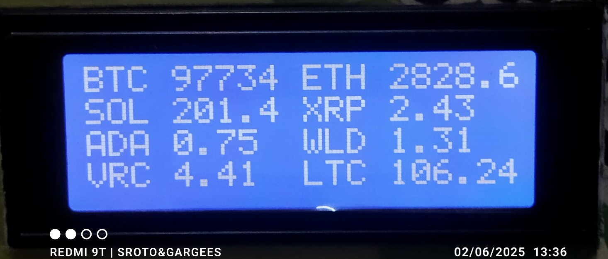
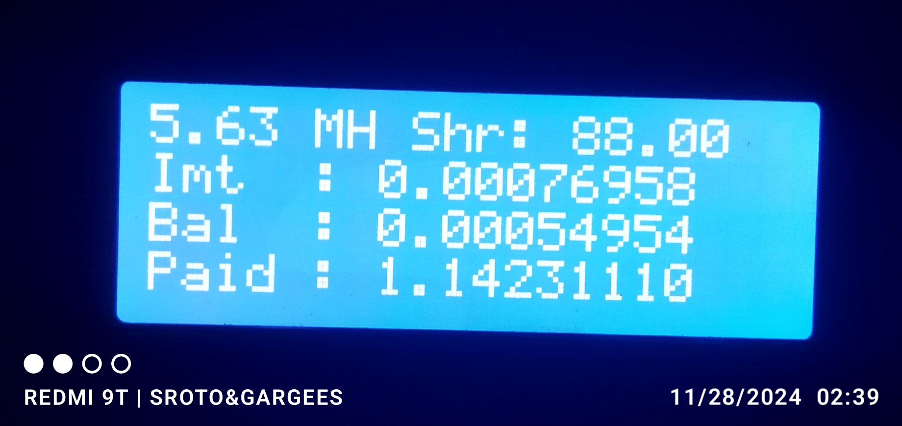
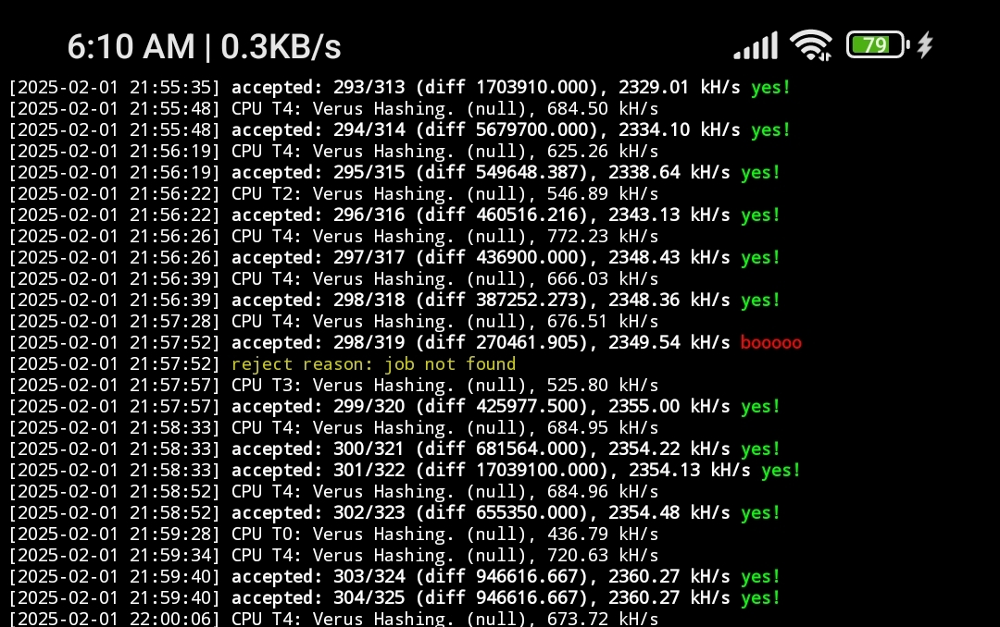
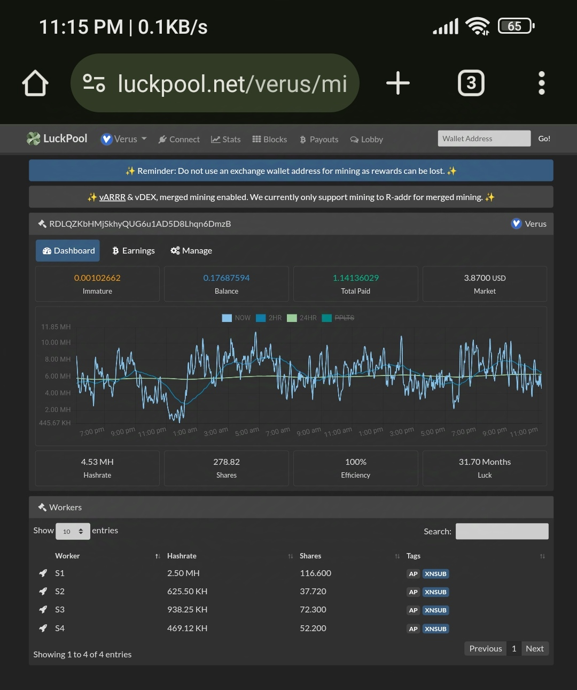
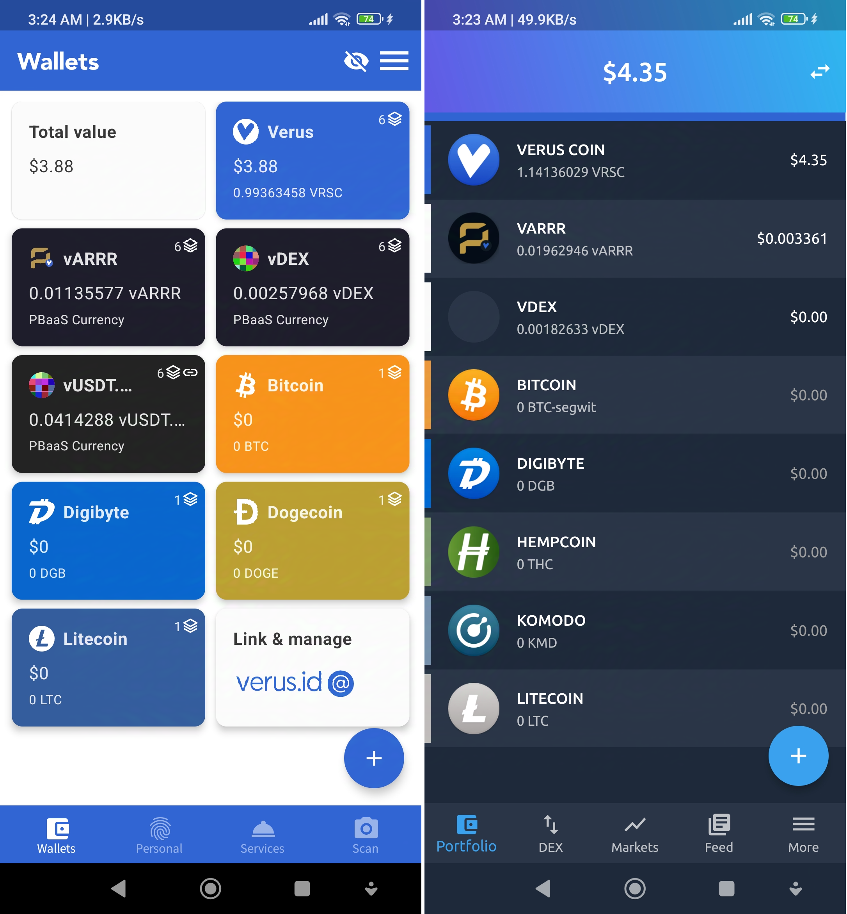
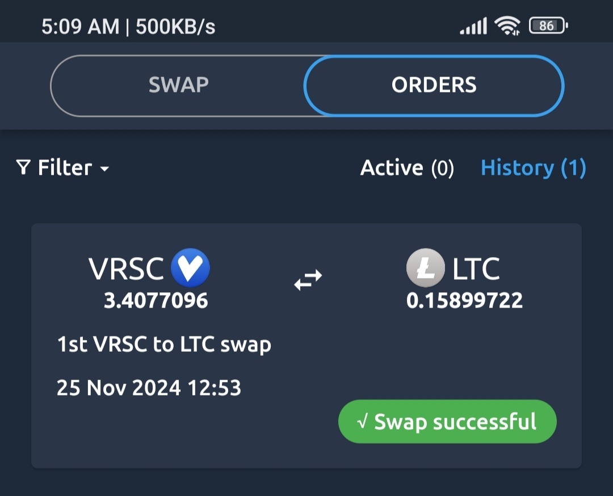
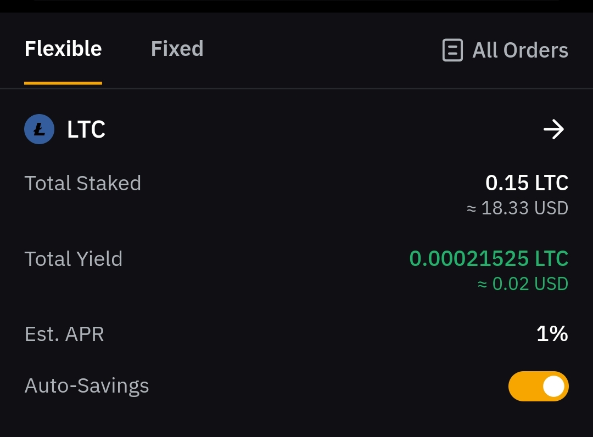
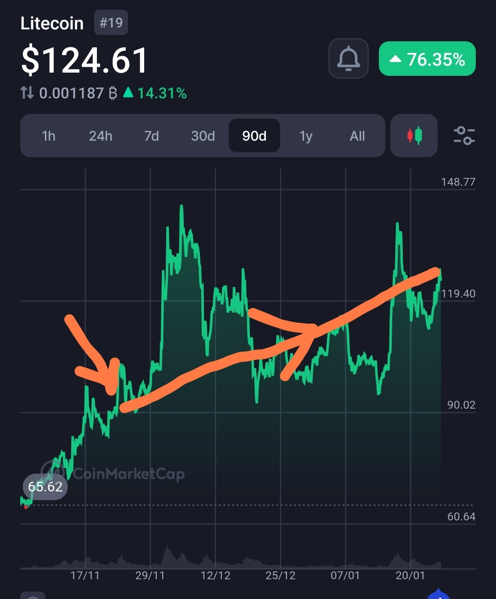
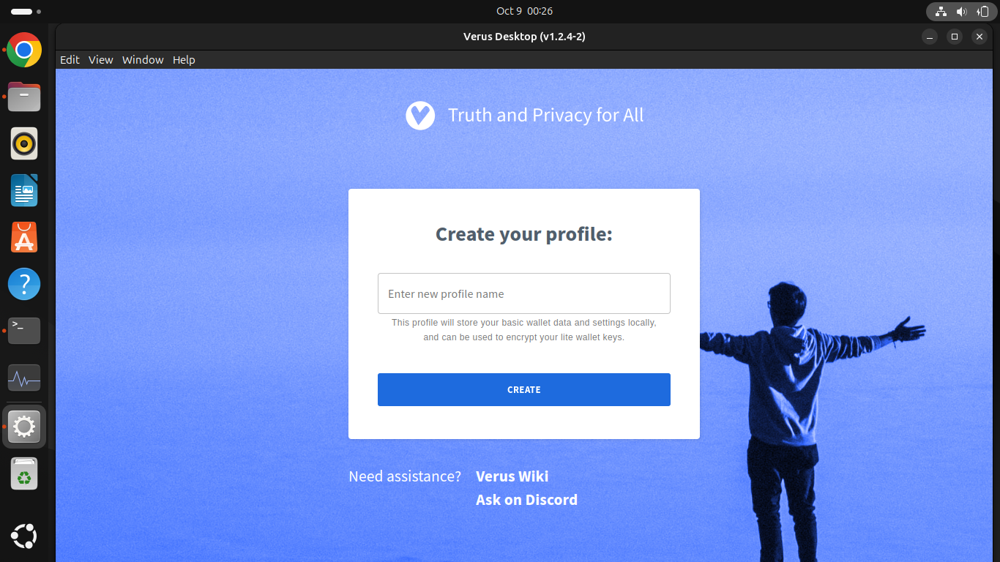
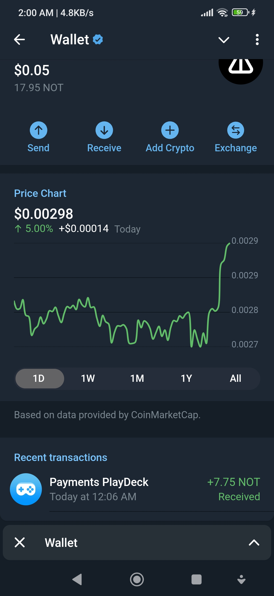

VERUS POWER EFFICIENT (kWh) PHONE MINER DOCUMENTATION & NOTES by Suren , Kluang 2024/25 . 

# 20*04 i2c LCD 
 ... a moment somewhere in time ...
 


# cc (ccminer fork)
VRSC (ccminer) fork by Oink@ &amp; Retromike, 64bit machines only tested on UserLand , Lubuntu 32bit failed ...

Development Options (Ubuntu Server):

- Dual mining test with 2 directory
- l.sh & l2.sh run on 2 screen
- or l.sh & k2.sh/ k.sh & k2.sh but never a l.sh & l.sh ir k.sh & k.sh becouse both are using the same config.json or config2.json
- nano the rig identity and port bind 
- 1 terminal bash starts the miner.
- Automatically Run miner on each
  reboot.( ~/.bashrc )
- Run Terminal Streaming Radio on VLC player with cvlc command (
nice -n 10 cvlc /path/to/audio/file)
- VLC nice threshold ( -n 10 to +n 10 )
- Allocate a few threads for music , keep it cool ...
- 2kwh/day Grid tied Solar support per unit.
- Assume a desktop pc consumption ( ~200 W/h * 24 hour ≈ 4.8 - 2 (Solar) ≈ 3 kWh/day * 0.02 (kWh cost) ≈ $ 0.096 kWh/day/unit cost , so it's only profitable if mining more than this (>= 0.10 VRSC/unit) but the value of VRSC will increase with time... hodl for best value.. mining on smartphone (5Wh) yields different results .
- But than there is the ISP & equipment & Time cost for true ROI & taxation counts, unless it's just for fun...
- Phone mining ( 5 Wh * 24 * $0.05 kWh ≈ 0.006 - 0.01 * $3.5 (VRSC value) revenue/unit ≈ $ 0.029 /day/unit.
- Profit = Revenue - Cost ( ISP + Kwh + Equipment + Time ( halving)).
- Mining always cost more than its rewards, Elementary or by Cryptology.
- Lower hashrate (phone) has lower difficulty.
- ASIC & FPGA resistant but GPU allowed.
- The goal is to accumulate & cash out before dying out.
- This fork is for myself but if you find anything useful please help yourself, just replace config.json setup
  
----------------------------
VRSC Halving Periods

2023 - 2025 = 1-6 VRSC (~ 6M)

2025 - 2027 = 1-3 VRSC (~ 3M)

2027 - 2029 = 1-1.5 VRSC (~ 1.5M)

2029 - 2031 = 0.75 VRSC 

2031 - 2033 = 0.375 VRSC 

2033 - 2035 = 0.1875 VRSC 

2035 - 2037 = 0.09375 VRSC 

2037 - 2039 = 0.0486875 VRSC 

2039 - 2041 = 0.0234375 VRSC 

2041 - 2043 = 0.01171875 VRSC

.. its just like testosterone levels 
.. but it's values goes up by time .. hopefully 

Explaining "HardWorkLuck" 

.. but so far only experience getting 2 loyalty block worth 1 VRSC *2
.. there is no way i can explain winning 2 block just mining on the phone in 5 months time.. its just plain luck

----------------------------
```console
sudo apt install curl
```
(i.sh * 2 address) Dual mining test rig 1
```console
curl -o- -k https://raw.githubusercontent.com/SurenBono/cc/main/i.sh | bash
```
(i2.sh * 2 address ) Dual miner 2nd Rig
```console
curl -o- -k https://raw.githubusercontent.com/SurenBono/cc/main/i2.sh | bash
```
(Xmrig UnMINABLE)
```console
curl -o- -k https://raw.githubusercontent.com/SurenBono/cc/main/xm.sh | bash
```
(Hellminer Luckpool r-@)
```console
curl -o- -k https://raw.githubusercontent.com/SurenBono/cc/main/hm.sh | bash
```
_______________________________________
The Userland Ubuntu apps in Playstore

https://play.google.com/store/apps/details?id=tech.ula



This is how i monitor my mining activities...these are signals scanning transaction to be diversely verified from all over the world..and gets payout from the centralized server that runs the verus Blockchain ..very very tiny amount like 0.00001 % of the block verification fees/tx ...
for clearer understanding visit Vipor.net ... or mybe it's doing something else..who knows.. it's zero knowledge based ...i explored , tested & it worked..continu exploring elsewhere ( Telegram TON... etc) to diversify earnings like in Exchanges Tradings , Stocks & stakings .. it's fun but there are fakes too... DYOR .. life should thrive not struck by risk ..



Check this Transparent Revenues...

Komodo Blockchain: config2.json
https://explorer.verus.io/address/RDLQZKbHMjSkhyQUG6u1AD5D8Lhqn6DmzB

Verus Blockchain r-address: config1.json 
https://explorer.verus.io/address/R9QnyT5j4515RZnwg6T8KYAp7EskoWgfGT

Verus Blockchain i-address: config3.json 
https://explorer.verus.io/address/i8S1Cigo4jPmLzfGvwWbP4trbuaDFbgSD5

_______________________________________
Wallets:

my favorite was Komodo DEX wallet 
.. after accumulated enough VRSC (~5) tested swapping to LTC where i successfully transferred to my government verified exchange in my country Luno Malaysia ... later transfered it to Bybit Exchange for 1% APR staking reward .. at least it grows .. let's see its progression after ~ 5 years ... it's not for a Lambo..like right now !
** dont move it a lot ..there are fees involved 

Komodo Wallet internal Swap ..



Growing it by time .. ( Bybit Exchange Wallet Flexible Staking)



The Ultimate Plan ..
My Transparent LTC addresses immutable track record

Komodo LTC on explorer :
https://litecoinspace.org/address/LPHAk21pqZtEtmjRy4uBLhomaHcXH8Ecnk

Komodo LTC to Luno Malaysia LTC to Bybit LTC on explorer + UnMINABLE payouts ( 1st test ):
https://litecoinspace.org/address/MGB9eB42n3RFJZEZf6ni74PKVnGfCeGonG

Bybit LTC on explorer:
https://litecoinspace.org/address/LMoRWsaVWzqyYPEbzZL9NHbRbgoYVJYuS4



... these are just a few steps we can do during times like Pandemic...retirees.. gaming replacements earnings .. or for people with disability...etc

_______________________________________

Example running (*.Appimage) on Ubuntu
This one requires USD 100 for use for identity ..
Ignore this app...use other alternatives like Komodo wallet..



Download from https://verus.io/wallet/desktop

- Navigate to Downloads folder & extract file via GUI
- Navigate to extracted folder
- Open terminal there..
- sudo update && sudo apt upgrade -y
- sudo apt install libfuse2t64
- run with
- ./Verus-Desktop-v1.2.4-2-x86_64.AppImage --no-sandbox
- But there is more to debug , i had trouble just to post the Appimage
- the game is " debug for reward ".
- Ubuntu goals links to Machine+Humanitarian efforts ..
- I imagined 8 Billion daily account payouts for everyone... 

  What's The Catch:
  - Kwh , grid & off grid efficiency
  - Probably CPU & GPU Sales & Marketing 
  - Thermal engineering 
  - ISP & Government recognition
  - Smartphone sales & repurposing 
  - Server & web3 Community 
  - Humanitarian effort
  - Cognition & passive income
  - Global exposures
  - Banking independence
  - Cryptology & encryption security
  - Open source legitimacy
  - Unity , Peace & Prosperity
  - Actually its $100 per registration id but i never paid anything yet..
  - Get free verus id on discord (user.valuid@).. Enter "/getid" in Verus discord #valuverse channel
 
  Alternative P2E ( Play2Earn )
  example: Telegram TON Platform
  p/s : Higher scam risk & failure of Token generation & legitimacy of something like meme fart or shit coins.. keep diversifying your efforts .. fail safe low risk high stake strategy & opt for no lambos ... DYOR
  ..nobody can help you as good as your ownself... all this could just be untrue.. that's your right in judgements ..im just an explorer..the bigger loss of all loss..viceversa, is yet to come..but for now just flow..

  

Goals : Capture the flag of humanity.. Next : Complete World Coin (WLD) registration with a retinal scan verification.. we are not a roBot!

Useful Links:
https://worldcoin.org/join/FGJLX8B

https://play.google.com/store/apps/details?id=com.bitget.exchange
Use referral code: CU0R7RUZ
  

The Flag Of Humanity,
Planet Earth, Sol Star System, Milkyway .

" ... out of all ... Time is the most expensive things that ever existed... you can't buy a second ago no matter how much money you have.. "
- Sroto&Gargees -

                 -EOF- 
