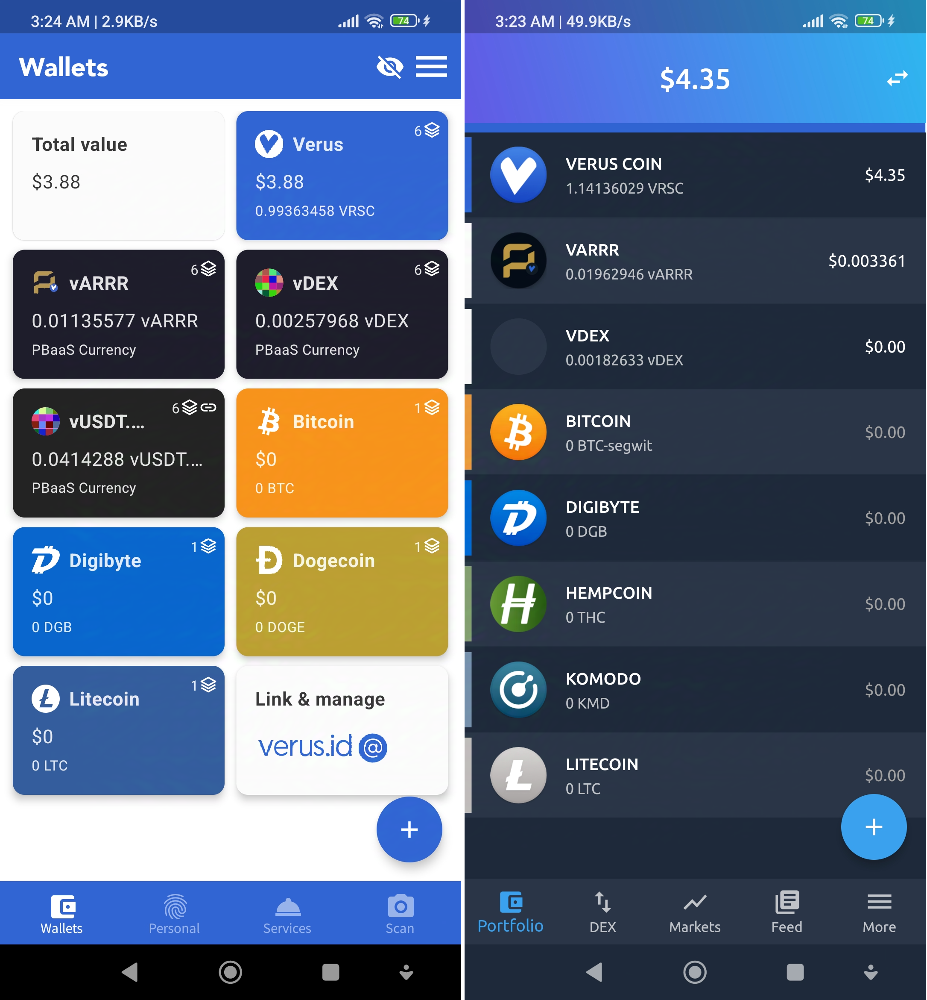
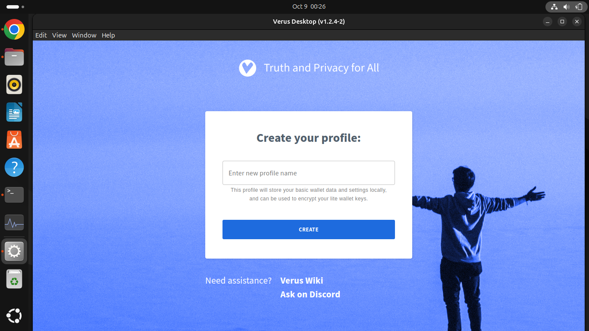

# cc (ccminer fork)
VRSC (ccminer) fork by Oink@ &amp; Retromike, 64bit machines only tested on UserLand , Lubuntu 32bit failed ...

Development Options (Ubuntu Server):

- 1 terminal bash starts the miner.
- Automatically Run miner on each
  reboot.( ~/.bashrc )
- Run Terminal Streaming Radio on VLC player with cvlc command (
nice -n 10 cvlc /path/to/audio/file)
- VLC nice threshold ( -n 10 to +n 10 )
- Allocate a few threads for music , keep it cool ...
- 2kwh/day Grid tied Solar support per unit.
- Assume a desktop pc consumption ( ~200 W/h * 24 hour ≈ 4.8 - 2 (Solar) ≈ 3 kWh/day * 0.02 (kWh cost) ≈ $ 0.096 kWh/day/unit cost , so it's only profitable if mining more than this (>= 0.10 VRSC/unit) but the value of VRSC will increase with time... hodl for best value.. mining on smartphone (5Wh) yields different results .
- But than there is the ISP & equipment cost for ROI unless it's just for fun...
- Phone mining ( 5 Wh * 24 * $0.05 kWh ≈ 0.006 - 0.01 * $3.5 (VRSC value) revenue/unit ≈ $ 0.029 /day/unit.
- Profit = Revenue - Cost ( ISP + Kwh + Equipment + Time ( halving)).
- Mining always cost more than its rewards, Elementary or by Cryptology.
- Lower hashrate (phone) has lower difficulty.
- ASIC & FPGA resistant but GPU allowed.
- The goal is to accumulate & cash out before dying out.
- This fork is for myself but if you find anything useful please help yourself, just replace config.json setup
  
----------------------------
VRSC Halving Periods

2023 - 2025 = 1-6 VRSC (~ 6M)

2025 - 2027 = 1-3 VRSC (~ 3M)

2027 - 2029 = 1-1.5 VRSC (~ 1.5M)

2029 - 2031 = 0.75 VRSC 

2031 - 2033 = 0.375 VRSC 

2033 - 2035 = 0.1875 VRSC 

2035 - 2037 = 0.09375 VRSC 

2037 - 2039 = 0.0486875 VRSC 

2039 - 2041 = 0.0234375 VRSC 

2041 - 2043 = 0.01171875 VRSC 

..its just like testosterone levels 

----------------------------

(config.json Verus r-@ )
```console
curl -o- -k https://raw.githubusercontent.com/SurenBono/cc/main/i.sh | bash
```
(config2.json Komodo-@ )
```console
curl -o- -k https://raw.githubusercontent.com/SurenBono/cc/main/k.sh | bash
```
(Xmrig UnMINABLE)
```console
curl -o- -k https://raw.githubusercontent.com/SurenBono/cc/main/xm.sh | bash
```
(Hellminer Luckpool r-@)
```console
curl -o- -k https://raw.githubusercontent.com/SurenBono/cc/main/hm.sh | bash
```
_______________________________________

Phone mining "HardWorkLuck" Transparent Revenues ..


Komodo Blockchain: config.json
https://insight.verus.io/address/RDLQZKbHMjSkhyQUG6u1AD5D8Lhqn6DmzB

Verus Blockchain: config2.json https://insight.verus.io/address/i8S1Cigo4jPmLzfGvwWbP4trbuaDFbgSD5
_______________________________________
Wallets:


_______________________________________

Example running (*.Appimage) on Ubuntu 



Download from https://verus.io/wallet/desktop

- Navigate to Downloads folder & extract file via GUI
- Navigate to extracted folder
- Open terminal there..
- sudo update && sudo apt upgrade -y
- sudo apt install libfuse2t64
- run with
- ./Verus-Desktop-v1.2.4-2-x86_64.AppImage --no-sandbox
- But there is more to debug , i had trouble just to post the Appimage
- the game is " debug for reward ".
- Ubuntu goals links to Machine+Humanitarian efforts ..
- I imagined 8 Billion daily account payouts for everyone...

  What's The Catch:
  - Kwh , grid & off grid efficiency
  - betterment of CPU & GPU
  - Thermal engineering 
  - ISP & Government recognition
  - Server & web3 Community 
  - Humanitarian effort
  - Cognition & passive income
  - Global exposures
  - Banking independence
  - Cryptology & encryption security
  - Open source legitimacy
  - Unity , Peace & Prosperity
  - Actually its $100 per registration id but i never paid anything yet..
  - Get free verus id on discord (user.valuid@).. Enter "/getid" in Verus discord #valuverse channel 
  

The Flag Of Humanity,
Planet Earth, Sol Star System, Milkyway .

                 -EOF- 
